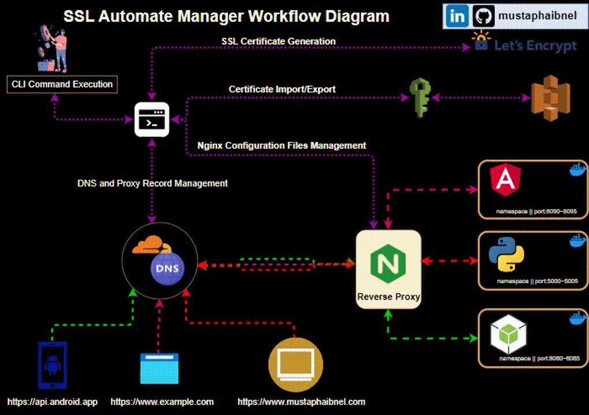

# Hello, I'm Mustapha Ibnel 👋

## About Me
I'm an experienced System Administrator and Full Stack Developer with a strong background in the IT industry. Passionate about leveraging my skills in various technologies, I develop efficient solutions and streamline processes.

## Featured Projects
<table>
  <tr>
    <td align="center">
      
       
      <strong>DevSecOps : SSL Automate Manager (Python)</strong>
    </td>
  <td align="center">
      
       
      <strong>DevSecOps : IaC and Configuration Management</strong>
    </td>
    <td align="center">
      
       
      <strong>DevSecOps : Comprehensive  CI/CD Pipeline with Jenkins</strong>
    </td>
  </tr>
</table>

## My Skills
- **Technical Skills**: System and Network Administration, Web & Mobile Application Development, Automation of Deployments, Cloud Computing, Windows, Linux Servers.
- **Management Skills**: Task Prioritization, Team Leadership, Strategic Planning, Problem-Solving, Time Management.
- **Languages**: Arabic, English, French.

## Experience
- Full Stack Developer and System Administrator: Expertise in web and mobile development, CI/CD pipelines, Windows Server, and network systems administration. Specialize in cross-platform solutions for diverse business needs.

## Featured Projects
1. **API Deployment on EC2**

-Deployed a custom API on a fully managed EC2 instance, demonstrating skills in cloud services, server management, and API integration.
<table>
  <tr>
    <td align="center">
      
       
      <strong>Infrastructure as Code and Configuration Management</strong>
    </td>
        <td align="center">
      
       
      <strong>Infrastructure as Code and Configuration Management</strong>
    </td>
        <td align="center">
      
       
      <strong>Infrastructure as Code and Configuration Management</strong>
    </td>
    <td align="center">
      
       
      <strong>Comprehensive CI/CD Pipeline with Jenkins</strong>
    </td>
  </tr>
</table>

2. **Front-End App on EKS**
-Utilized Terraform and Jenkins to deploy a front-end application on EKS, showcasing expertise in Kubernetes and modern app deployment techniques.
<table>
  <tr>
    <td align="center">
      
       
      <strong>Infrastructure as Code and Configuration Management</strong>
    </td>
        <td align="center">
      
       
      <strong>Infrastructure as Code and Configuration Management</strong>
    </td>
        <td align="center">
      
       
      <strong>Infrastructure as Code and Configuration Management</strong>
    </td>
    <td align="center">
      
       
      <strong>Comprehensive CI/CD Pipeline with Jenkins</strong>
    </td>
  </tr>
</table>

3. **App Scaling on GKE with Firebase**

-Developed a scalable app hosted on GKE, employing a distributed system architecture with Firebase. Included a feature for image resizing to demonstrate proficiency in handling dynamic content.
<table>
  <tr>
    <td align="center">
      
       
      <strong>Infrastructure as Code and Configuration Management</strong>
    </td>
        <td align="center">
      
       
      <strong>Infrastructure as Code and Configuration Management</strong>
    </td>
        <td align="center">
      
       
      <strong>Infrastructure as Code and Configuration Management</strong>
    </td>
    <td align="center">
      
       
      <strong>Comprehensive CI/CD Pipeline with Jenkins</strong>
    </td>
  </tr>
</table>
## Currently Learning 
Expanding my expertise in AWS and Google Cloud to optimize and scale applications.

## Connect with Me 
- 📧 Email: [mustapha.ibnel@mail.com](mailto:mustapha.ibnel@mail.com)
- 🗨️ LinkedIn: [mustaphaibnel](https://linkedin.com/in/mustaphaibnel)
- 🐦 Twitter: [@mustaphaibnel](https://twitter.com/mustaphaibnel)
- 📸 Instagram: [@mustaphaibnel](https://instagram.com/mustaphaibnel)
